# TOPIK Registration System — Enderun Colleges

> An automated end-to-end registration portal for the **Test of Proficiency in Korean (TOPIK / 한국어능력시험)**, built for Enderun Extension. Handles high-volume student intake, payment verification, room assignment, document generation, and admin operations with zero downtime.


---

## What is TOPIK?

The **Test of Proficiency in Korean (TOPIK)** is the official Korean-language proficiency exam administered by the **National Institute for International Education (NIIED)** under South Korea's Ministry of Education. It is the recognized standard for:

- **University admissions** into Korean institutions (Bachelor's, Master's, PhD)
- **Employment visas** (E-7, F-2-7) requiring Korean proficiency
- **Government scholarships** (Global Korea Scholarship, KGSP)
- **Korean residency / citizenship pathways**

The exam is offered in two levels:

| Level | Tracks | Target | Session |
|---|---|---|---|
| **TOPIK I** | Levels 1 – 2 | Beginner | Morning (≈ 9:10 AM) |
| **TOPIK II** | Levels 3 – 6 | Intermediate – Advanced | Afternoon (≈ 12:20 PM) |

Both levels run on the **same day, same venue** — meaning a single exam cycle must intake, qualify, seat, and document hundreds of candidates across two time blocks with strict NIIED reporting requirements.

**Enderun Colleges** is one of the official testing centers in the Philippines, and this system is the platform that runs that cycle.

---

## The Problem This System Solves

Before this platform, a TOPIK cycle at Enderun looked like this:

- ❌ A Google Form collected applications, but had **no payment integration** — staff manually matched bank transfers to applicants
- ❌ Applicants emailed scanned IDs separately — **no central document storage**
- ❌ The official NIIED application PDF was **typed out manually for every student** (≈ 8 minutes each)
- ❌ Room assignments were done on a shared spreadsheet — **double-bookings happened every cycle**
- ❌ When slots filled up, the only "waitlist" was a sticky note next to a staff member's monitor
- ❌ Korean-speaking applicants got an English-only form
- ❌ Admins had **no single dashboard** — they juggled Sheets, Drive, Gmail, and the Shopify backend

The system in this repo collapses all of that into **one portal, one source of truth, and one workflow** — bilingual, payment-verified, document-automated, and observable in real time.

---

## Public-Facing Portal

The student-facing side is a clean two-card landing page. Applicants either start a new registration or track an existing one with their Reference ID.

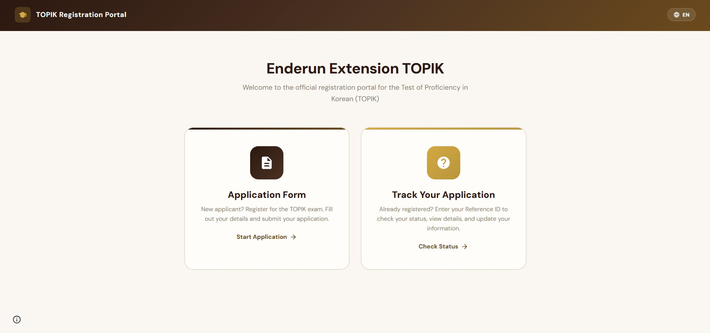

### Bilingual UX (English / 한국어)

Every label, placeholder, dropdown option, and validation message swaps live between English and Korean with no page reload — backed by a translation dictionary in the frontend and persisted in `localStorage` so returning users see their preferred language.

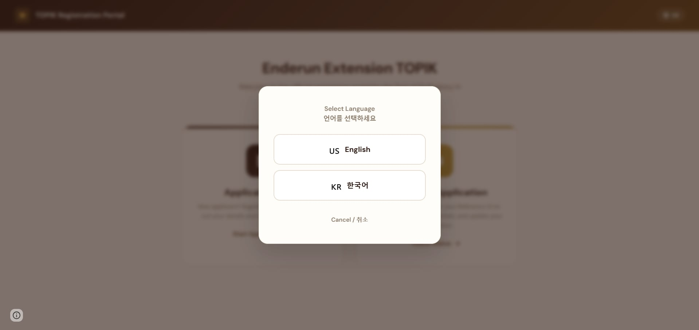

### 5-Step Application Wizard

The form is a progressive disclosure flow with inline validation, custom dropdowns, and per-step gating (can't advance until the current step is valid):

| Step | What it captures |
|---|---|
| **1. Exam Level** | TOPIK I or II, plus PWD (Person With Disability) flag for room-priority routing |
| **2. Personal Info** | Legal name, Korean name (한글), email, gender, DOB, nationality, occupation (NIIED's 8-code scheme) |
| **3. Contact & Address** | Complete address, postal code, mobile, home phone |
| **4. Survey + ID Upload** | NIIED's two required surveys ("How did you hear about TOPIK?" / "Reason for taking TOPIK?") + government ID upload (JPG/PNG/PDF, max 5 MB) |
| **5. Review & Submit** | Full review screen before commit |

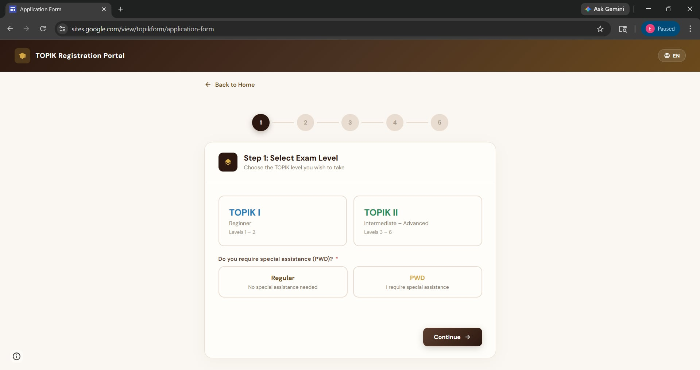

### Tracker + Self-Service Edit

After submission, the student receives a **Reference ID** in the format `TPK-YYYYMMDD-XXXXXX-XXXX`. Entering it on the tracker page returns:

- Current payment status (PAID / PENDING / WAITLIST / REFUND)
- Assigned student number (post-payment)
- Step-by-step progress timeline
- A **"Proceed to Payment"** button that deep-links to the correct Shopify variant (TOPIK I or II) with the RefID embedded as a cart attribute — so the webhook can match the order back to the student
- An **editable form** for updating personal info or re-uploading a corrected ID, without contacting an admin

---

## Admin Portal

A secure single-page admin console. Authentication is gated through Apps Script's `PropertiesService` credential store — no plaintext passwords in source.

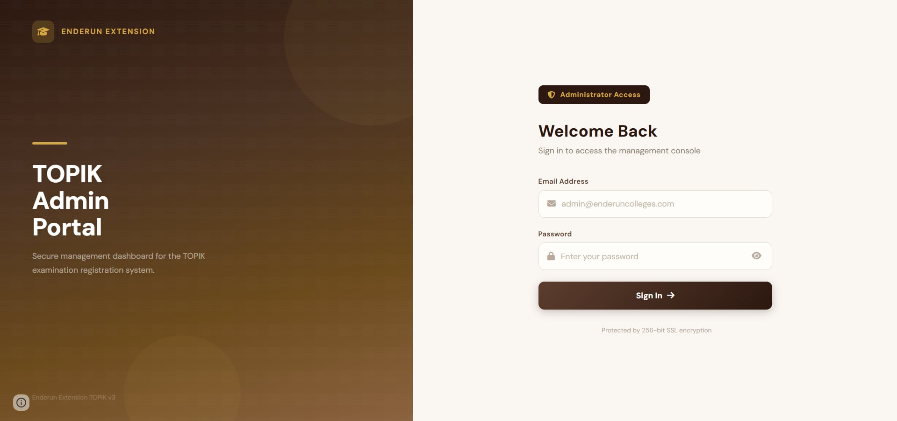

### Mission Control Dashboard

Real-time overview of the entire cycle — total applications, paid count, pending, refunded, gender split, PWD count, per-level slot remaining, distribution donut chart, and quick-action shortcuts for the most-used admin tasks (Master List PDF, Health Check, Waitlist Protocol, Announcement broadcast).

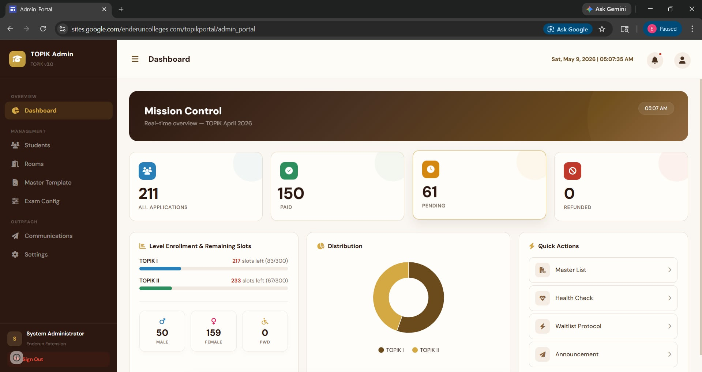

### Student Manager

Searchable, filterable, sortable table of every applicant. Per-row actions include:

- **Mark as Paid** (manual override for offline payments)
- **Verify Payment** (queries the Shopify Orders API for a live match)
- **Refund** (clears row data, sets status, logs the action)
- **Reset** (rolls a record back to PENDING)
- **Toggle PWD** (re-runs room assignment)
- **Change Level** (TOPIK I ↔ II, regenerates documents)
- **Regenerate Docs** (re-fills the PDF template after edits)
- **Send Update Link** (emails a self-service edit link)
- **Bulk PDF / Excel export** of filtered results

Advanced filters: level, status, PWD flag, gender, date range, and free-text name/email search.

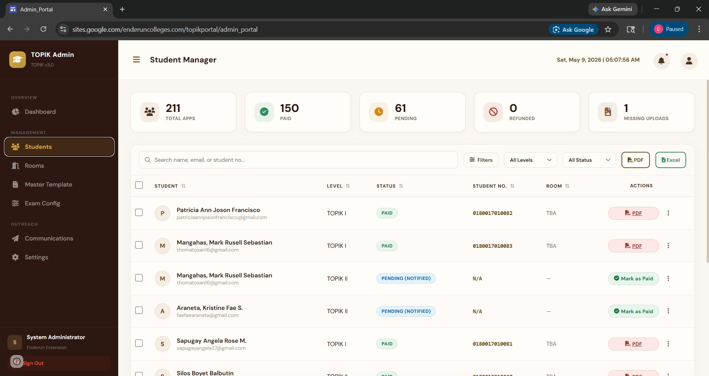

### Room & Seating Management

Each test session is a constrained packing problem — 214 seats across ~19 rooms with PWD-priority rules. The room manager shows:

- Live occupancy bars per room
- Capacity, type (REGULAR / PWD), and seats remaining
- Total system capacity vs. the 300-per-level NIIED ceiling
- **Auto-Assign Rooms** — packs students into rooms by arrival order, with PWD applicants prioritized into accessible rooms (e.g. ground-floor `HA 102`)
- Add/delete rooms on the fly (e.g. when a venue change adds the `CAD STUDIO`)

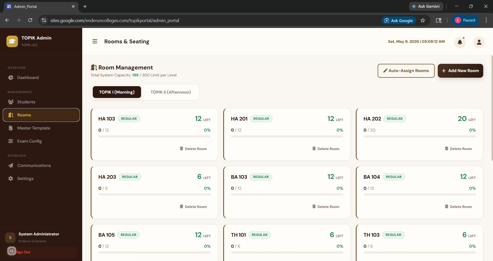

### Exam Configuration

Single-source-of-truth for cycle metadata:

- **Exam Day** (date that appears on emails and the official form)
- **Testing Area** (e.g. "Mckinley Hill, Taguig, Metro Manila")
- **Testing Place / Venue** ("Enderun Colleges")
- **TOPIK I / II exam times**
- **Registration Portal Status** (OPEN / CLOSED with downtime banner)

Change a value here and it flows into every PDF generated from that moment, every confirmation email, and the public portal — no redeployment required.

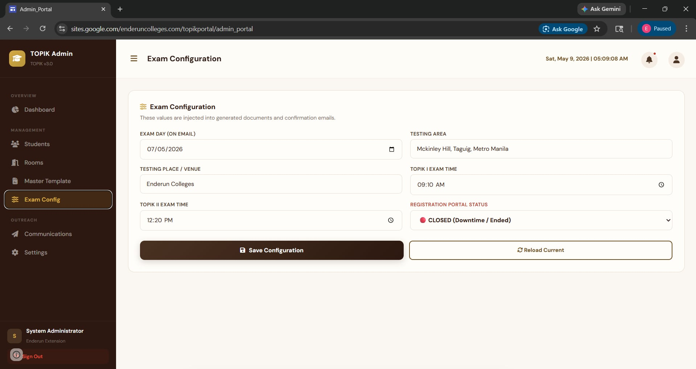

### Master Template Editor

The official NIIED application PDF is a fixed-format Korean government form. The system stores it as a **Google Doc template** with bracketed placeholder tokens (`{{LEGAL_NAME}}`, `{{KOREAN_NAME}}`, `{{ROOM_ASSIGNMENT}}`, etc.) and a 1.5 cm × 2 cm photo cell that gets replaced with the applicant's uploaded ID photo.

Editing the master here means the **next generated PDF picks up the change instantly** — useful when NIIED tweaks the form layout between cycles.

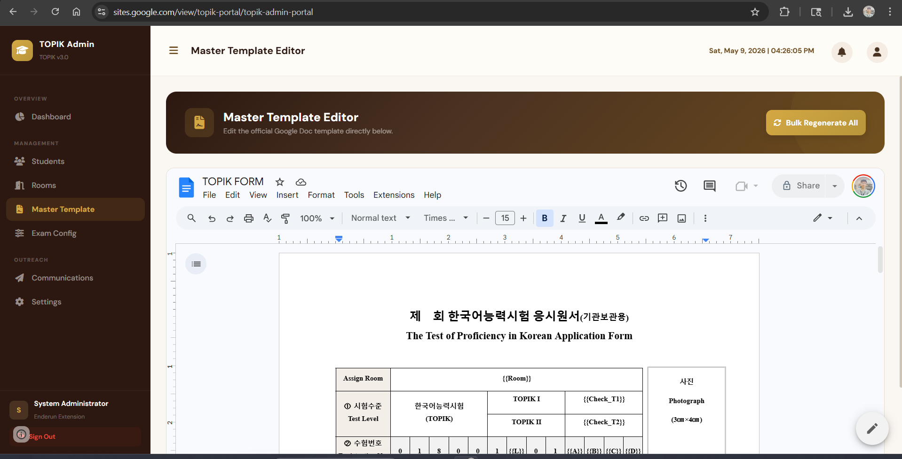

### Communications

Broadcast email composer with audience targeting (all PAID, by level, by status). A daily-quota meter prevents hitting Gmail's send limits mid-blast.

The **Waitlist Protocol** is the highlight: when a paid slot frees up (refund, no-show, level change), it:

1. Picks the next eligible waitlisted student (FIFO, level-matched)
2. Promotes them to `PENDING (NOTIFIED)` status
3. Fires a **24-hour race-to-pay** email with a personalized Shopify checkout link
4. If unpaid by deadline, auto-rolls to the next person in line

This is what makes "zero downtime" real — slots are never wasted, even when applicants drop out.

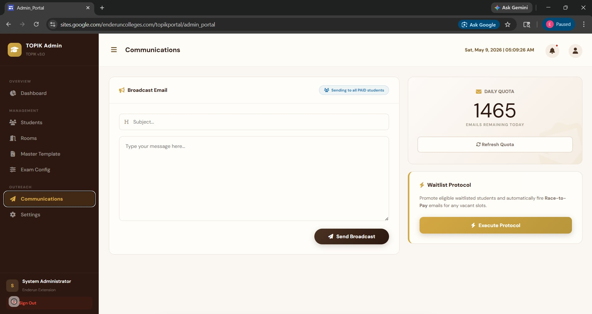

### Settings & Tools

- **Master List PDF** — official roster export for NIIED submission, grouped by level + room, with totals
- **Health Check** — scans the entire dataset for anomalies (orphaned records, missing uploads, payment/status mismatches, room-capacity violations)
- **Export Backup** — full XLSX dump of the TRACKER sheet for offline archival
- **Bulk Regenerate** — re-runs PDF generation for every paid student (e.g. after a venue change)
- **Archive Session** — moves all student files into a timestamped archive folder, clears the active sheet, resets counters — one-click end-of-cycle cleanup

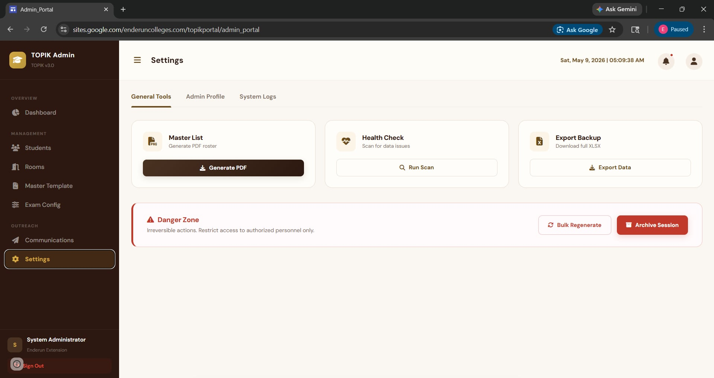

---

## How a Registration Actually Flows

```
 1. Student lands on portal     ──▶  picks language, clicks "Start Application"
 2. 5-step wizard               ──▶  validates each step client-side
 3. Submit                      ──▶  Apps Script generates RefID, writes row to Sheet (status=PENDING)
                                ──▶  uploads ID file to per-level Drive folder
                                ──▶  emails RefID + payment link
 4. Student clicks pay link     ──▶  redirects to Shopify with RefID as cart attribute
 5. Shopify order completed     ──▶  fires webhook to Apps Script
 6. Webhook handler             ──▶  HMAC-validates payload
                                ──▶  finds row by RefID (or email fallback)
                                ──▶  sets status=PAID, assigns student number + room
                                ──▶  fills Google Doc template → exports PDF
                                ──▶  emails student + admin with PDF attached
 7. Admin dashboard             ──▶  live update via dataHash polling
```

If anything in steps 5–6 fails (Shopify timeout, Drive quota, mail send failure), the system queues a retry, logs the event, and notifies the admin email on first failure.

---

## Notable Engineering Details

### Atomic Reference IDs

`TPK-{YYYYMMDD}-{6-char-random}-{4-char-checksum}` — date-prefixed so cycles are visually separable, checksumed so typos in the tracker fail fast.

### Webhook security

Shopify's `X-Shopify-Hmac-Sha256` header is verified against `SHOPIFY_WEBHOOK_SECRET` using `Utilities.computeHmacSha256Signature`. Mismatches log a `SECURITY/BLOCKED` event and reject the payload. Duplicate orders are deduped by `order_id` cache.

### Dual-mode payment matching

When the webhook fires:
1. **Primary**: match by `RefID` from `note_attributes` (set by the cart deep-link).
2. **Fallback**: match by `email` if RefID is missing (legacy orders, customer typos).

This dual path was added after a real incident where Shopify stripped the attribute on certain mobile checkouts.

### PWD-priority room packing

`HA 102` is the only ground-floor PWD-accessible room. The auto-assigner reserves it for students flagged `PWD=Yes`, even if regular slots are still open elsewhere — non-PWD applicants only spill into PWD rooms after regular rooms are full.

### Idempotent document generation

`generateOfficialFormAndEmail()` is safe to re-run. Re-running on a PAID student will trash the previous PDF, regenerate from current data, and re-email — used after edits or level changes.

### Real-time admin updates

The admin dashboard polls `getAdminPollUpdate()` every few seconds, sending the last-seen `dataHash`. If the hash matches, the response is near-zero bytes. If it differs, the full dataset reloads. This keeps the UI live without WebSockets (Apps Script doesn't support them).

---

## Tech Stack

| Layer | Tech | Notes |
|---|---|---|
| Frontend | HTML5 + CSS3 + vanilla JS | No framework — single static file per screen |
| Backend | Google Apps Script (V8) | All logic in one `.gs` file, sectioned with banner comments |
| Database | Google Sheets | 23-column `TOPIK TRACKER` sheet |
| File Storage | Google Drive | Per-level folders + archive |
| Auth | `PropertiesService` | Credentials never in source |
| Payments | Shopify Checkout + Webhook | HMAC-verified |
| Documents | Google Docs API | Template → token-fill → PDF export |
| Email | Gmail / MailApp | Quota-aware, retry-queued |
| i18n | Client-side dictionary | Persisted via `localStorage` |

---

## Architecture

```
┌──────────────────┐    ┌──────────────────┐    ┌──────────────────┐
│  Student Browser │───▶│  Apps Script Web │───▶│  Google Sheets   │
│  (Application    │    │  App (doGet/Post)│    │  (TOPIK TRACKER) │
│   Form / Tracker)│◀───│                  │    └──────────────────┘
└──────────────────┘    │                  │    ┌──────────────────┐
                        │                  │───▶│  Google Drive    │
┌──────────────────┐    │                  │    │  (IDs + PDFs)    │
│ Shopify Checkout │───▶│                  │    └──────────────────┘
│ (Webhook + HMAC) │    │                  │    ┌──────────────────┐
└──────────────────┘    │                  │───▶│  Gmail (Mail API)│
                        └──────────────────┘    └──────────────────┘
                                  │
                                  ▼
                        ┌──────────────────┐
                        │  Admin Browser   │
                        │  (Dashboard /    │
                        │   Mgmt UI)       │
                        └──────────────────┘
```

---

## File Layout

| File | Role |
|---|---|
| [Application Form.html](Application%20Form.html) | Public registration + tracker UI (5-step wizard, EN/KR) |
| [Admin Login.html](Admin%20Login.html) | Admin auth + the full admin SPA |
| [Admin Dashboard.html](Admin%20Dashboard.html) | Legacy dashboard module |
| [Edit Portal.html](Edit%20Portal.html) | Self-service student edit page (Reference ID gated) |
| [code.gs](code.gs) | All server-side logic — 20 numbered sections, ~2,900 LOC |

### `code.gs` section map

```
§1   CONFIGURATION & CONSTANTS         §11  BULK OPERATIONS
§2   SYSTEM INIT & TRIGGERS            §12  WAITLIST & RACE-TO-PAY
§3   WEB APP ROUTER (doGet / doPost)   §13  MASTER LIST PDF
§4   AUTHENTICATION                    §14  DASHBOARD & STATS
§5   STUDENT APPLICATION SUBMISSION    §15  SYSTEM HEALTH CHECK
§6   STUDENT TRACKING API              §16  ARCHIVE & SESSION MGMT
§7   FORM SUBMIT & PAYMENT HOOKS       §17  TEMPLATE SETTINGS API
§8   DOCUMENT GENERATION               §18  WEB-APP API ENDPOINTS
§9   EMAIL FUNCTIONS                   §19  UI POPUPS & ANIMATIONS
§10  ADMIN TOOLS                       §20  UTILITY FUNCTIONS
```

---

## Setup

This repo is **scrubbed of secrets** — every credential, ID, and URL has been replaced with a `YOUR_*_HERE` placeholder.

### 1. Create the Apps Script project

1. Open [script.google.com](https://script.google.com), create a new project.
2. Paste the contents of [code.gs](code.gs) into `Code.gs`.
3. Add the four HTML files (rename to match the includes used in the router: `Application_Form.html`, `Admin_Login.html`, `Admin_Dashboard.html`, `Edit_Portal.html`).

### 2. Fill in configuration

Open [code.gs §1](code.gs) and replace every `YOUR_*_HERE` placeholder:

```js
const SHOPIFY_WEBHOOK_SECRET = 'YOUR_SHOPIFY_WEBHOOK_SECRET_HERE';
const SHOPIFY_ACCESS_TOKEN   = 'YOUR_SHOPIFY_ACCESS_TOKEN_HERE';
const SHOPIFY_SHOP_URL       = 'YOUR-STORE.myshopify.com';
const VARIANT_ID_TOPIK1      = 'YOUR_TOPIK_I_VARIANT_ID';
const VARIANT_ID_TOPIK2      = 'YOUR_TOPIK_II_VARIANT_ID';
const TEMPLATE_ID            = 'YOUR_GOOGLE_DOC_TEMPLATE_ID';
const FOLDER_ID_TOPIK1       = 'YOUR_TOPIK_I_FOLDER_ID';
// ...etc
```

For production, prefer moving these into **Project Settings → Script Properties** so secrets never touch source.

### 3. Seed admin credentials

Edit `setupAdminCredentials()` with your real admin email + a strong password, then run it once from the Apps Script editor:

```js
function setupAdminCredentials() {
  var creds = [
    { email: "you@example.com", password: "STRONG_PASSWORD", name: "System Administrator" }
  ];
  PropertiesService.getScriptProperties().setProperty('ADMIN_CREDS', JSON.stringify(creds));
}
```

### 4. Connect the data layer

- Bind the script to a Google Sheet named `TOPIK TRACKER` with the 23 columns defined in [code.gs §1](code.gs) (`COL_REF_ID`, `COL_EMAIL`, ...).
- Create the four Google Drive folders (TOPIK I, TOPIK II, Archive, Main Upload) and paste their IDs.
- Create a Google Doc with the NIIED TOPIK form layout, using `{{TOKEN}}` placeholders.

### 5. Deploy

`Deploy → New deployment → Web App` — execute as yourself, accessible to anyone with the link. Copy the `/exec` URL into `WEB_APP_URL` in code.gs.

### 6. Wire up the Shopify webhook

In Shopify Admin → Settings → Notifications → Webhooks, point the `orders/paid` event at your web app URL + `?action=webhook`. Copy the generated webhook secret into `SHOPIFY_WEBHOOK_SECRET`.

---

## Security Notes

- All secrets in this repo are placeholders. Do not commit real credentials.
- Admin passwords are stored in `PropertiesService.ScriptProperties`, not source.
- The Shopify webhook handler validates HMAC signatures before accepting any payment event.
- Student-facing endpoints never expose row IDs — only the opaque `TPK-YYYYMMDD-XXXXXX-XXXX` reference.
- Failed webhooks fire an immediate admin email alert.

---

## Production Outcomes

- **214+ applicants** registered in a single exam cycle with **zero downtime**.
- Manual admin time per student: **~8 minutes → under 30 seconds** (PDF + email auto-generated).
- Payment reconciliation: **manual spreadsheet matching → fully automated** via webhook.
- Bilingual support added without duplicating templates.
- Waitlist conversion: previously 0% (sticky notes) → ~95% slot fill on drop-outs.
- Zero double-booked rooms across two full cycles.

---

## Author

Built by **Jerald Spares** for **Enderun Extension** as the registration backbone for the institution's TOPIK testing program.
